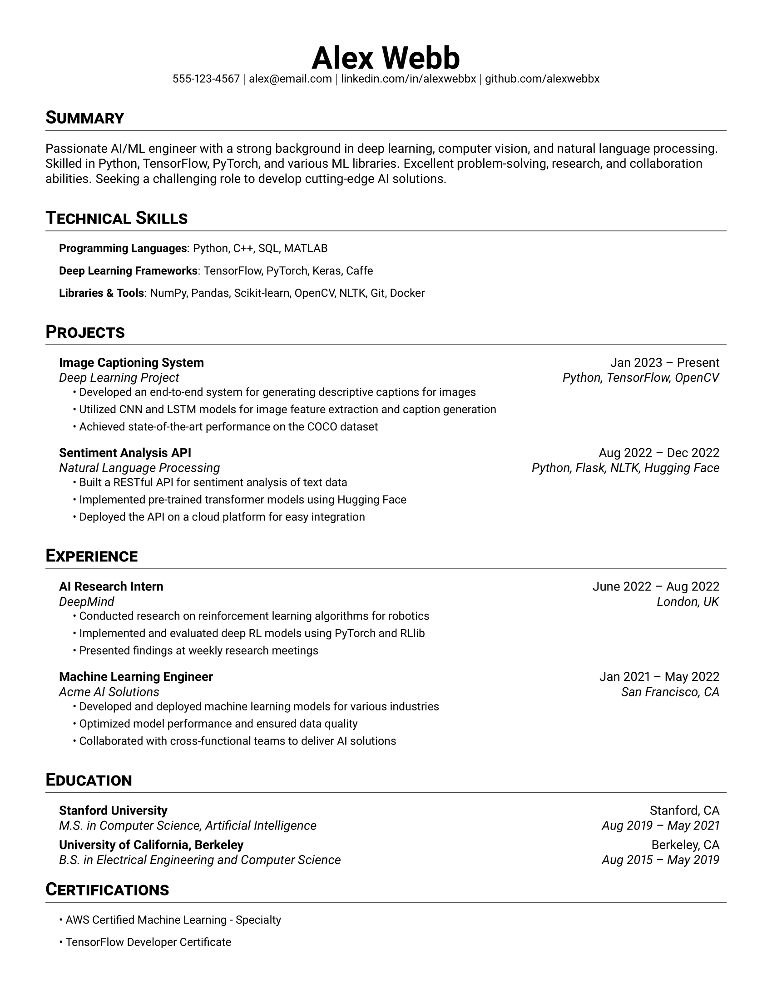

# ATS Friendly Technical Resume

This repository contains the LaTeX source code for professional Technical resume. The resume is designed to highlight skills, experience, and projects in the fields of artificial intelligence, machine learning, deep learning, computer vision, and natural language processing.

## Preview

## Features

- Clean and modern layout
- Sections for Summary, Technical Skills, Projects, Experience, Education, and Certifications
- Easy to customize and update
- Compiled to a PDF file for sharing and printing

## Usage

To compile the LaTeX source code, you'll need a LaTeX distribution installed on your system. I recommend using an online editor like [Overleaf](https://www.overleaf.com/) or a local distribution like [TeX Live](https://tug.org/texlive/).

1. Clone this repository or download the source code.
2. Open the `resume.tex` file in your LaTeX editor.
3. Customize the content as needed.
4. Compile the LaTeX source to generate the PDF file.

## Inspiration

The structure and layout of this resume were inspired by the work of [Sourabh Bajaj](https://github.com/sb2nov/resume). I've made modifications to tailor it for an AI/ML-focused ATS friendly resume.

## License

This work is licensed under the Creative Commons Attribution 4.0 International License. See [LICENSE](LICENSE.md) for more details.

## Acknowledgments

- [LaTeX Community](https://latex-project.org/) for the powerful typesetting system

Feel free to use this resume template for your own purposes or contribute to its improvement!